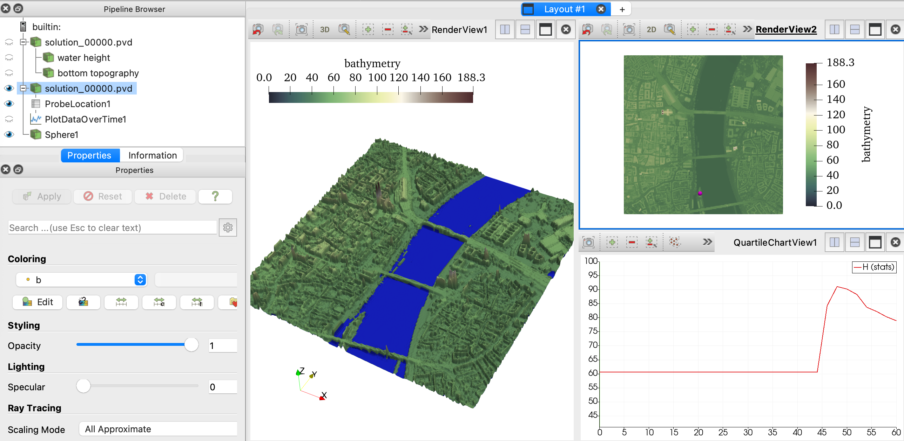

# TRUDI 2026 -- TrixiShallowWater tutorial

This provides a copy of the slides regarding the TrixiShallowWater.jl features
as well as the files needed to setup some interesting examples such as a bottom
topography and flooding run.

Note, the instructions below assume that your Julia REPL is instantiated from the main folder of this repository.

## Lake-at-rest over complex bathymetry

We begin with the general setup of a lake-at-rest test case with complex bottom topography.
Below is information on component and how the `elixir_shallowwater_wave_runup_flood_exercise_version.jl` is constructed.

This example will demonstrate how to:
- Set up a SWE solver for wet/dry transitions
- Approximate bathymetry data with [TrixiBottomTopography.jl](https://github.com/trixi-framework/ixiBottomTopography.jl)
- Create custom initial conditions and a wave maker boundary condition
- Postprocess solution data with [Trixi2Vtk.jl](https://github.com/trixi-framework/Trixi2Vtk.jl)
- Visualization with [ParaView](https://www.paraview.org/download/)

### Load required packages
The core solver component is TrixiShallowWater.jl,
which requires [Trixi.jl](@extref Trixi.jl) for the underlying spatial discretization
and OrdinaryDiffEqSSPRK.jl for time integration.
HOHQMesh.jl is needed to generate a mesh for this problem.
TrixiBottomTopography.jl is needed to create a bathymetry approximation that is directly
usable by Trixi.jl.
The optimization packages [HiGHS.jl](https://github.com/jump-dev/HiGHS.jl)
and [JuMP.jl](https://github.com/jump-dev/JuMP.jl) are needed to create
an L1 spline approximation for the bottom topography.
Finally, we include [GLMakie.jl](https://docs.makie.org/stable/) for bathymetry visualization and Trixi2Vtk.jl for postprocessing.
```julia
using HOHQMesh
using OrdinaryDiffEqSSPRK
using Trixi
using TrixiShallowWater
using TrixiBottomTopography
using JuMP, HiGHS
using GLMakie
using Trixi2Vtk
```

### Visualize the bathymetry
First, we construct the L1 spline approximation of the bathymetry data
provided in the file `"dgm_merged.txt"`.
To create the L1 spline approximation execute
```julia
# Point to the two dimensional bottom data
bathymetry_data = joinpath(@__DIR__, "TrixiSW", "dgm_merged.txt")

# Shape preserving L1 spline interpolation of the data
spline_struct = LaverySpline2D(bathymetry_data)
spline_func(x::Float64, y::Float64) = spline_interpolation(spline_struct, x, y)
```

We can visualize the bathymetry with the following
```julia
# Define interpolation points
n = 700
x_int_pts = Vector(LinRange(spline_struct.x[1], spline_struct.x[end], n))
y_int_pts = Vector(LinRange(spline_struct.y[1], spline_struct.y[end], n))

# Get interpolated points
z_int_pts = evaluate_two_dimensional_interpolant(spline_func, x_int_pts, y_int_pts)

# Note! Take the transpose here due to a plotting format quirk
# (The spline data is actually in the correct format for TrixiShallowWater.jl as is)
surface(x_int_pts, y_int_pts, z_int_pts';
        axis = (type = Makie.Axis3,
                       xlabel = "ETRS89\n East", ylabel = "ETRS89\n North", zlabel = "DHHN2016\n Height",
                       azimuth = -50 * pi / 180, elevation = 25 * pi / 180,
                       aspect = (1, 1, 0.2)),
        colormap = :greenbrownterrain,
        colorrange = Makie.quantile(vec(z_int_pts), (0.02, 0.999)))
```

### Create a quadrilateral mesh
We use HOHQMesh.jl to create a Cartesian mesh
(although a bit of overkill it makes creating the boundary condition later easier
due to normal vector and boundary naming conventions).

To begin, we create a new mesh project.
The output files created by HOHQMesh will be saved into the "out" folder
and carry the same name as the project, in this case "CartesianBox".
```julia
flood = newProject("CartesianBox", "out");
```

Next, we set the polynomial order for the boundaries to be linear, i.e., polynomials of degree one.
The file format is set to ["ABAQUS"](https://trixi-framework.github.io/TrixiDocumentation/stable/meshes/p4est_mesh/#Mesh-in-two-spatial-dimensions)
as it is compatible with the `P4estMesh` type that will be used later in the solver.
```julia
setPolynomialOrder!(flood, 1)
setMeshFileFormat!(flood, "ABAQUS");
```

The square domain for this problem has no interior or exterior boundary curves.
To suppress extraneous output from HOHQMesh during the mesh generation process we create
an empty MODEL dictionary.
```julia
HOHQMesh.getModelDict(flood);
```

Now we can create the Cartesian box mesh directly from the endpoints
of the data present in the `spline_struct` that define the domain of the problem.
The domain boundary edges are provided in `bounds` with order `[top, left, bottom, right]`.
The background grid uses `40` elements in each direction
```julia
bounds = [spline_struct.y[end], spline_struct.x[1], spline_struct.y[1], spline_struct.x[end]];
N = [40, 40, 0];
addBackgroundGrid!(flood, bounds, N)
```
We can generate the mesh with `generate_mesh` that prints mesh quality statistics and creates
the corresponding mesh file.
```julia
generate_mesh(flood);
```

### Discretize the problem setup
With the mesh and bathymetry spline in hand we can proceed to construct the solver components and callbacks
for the wave runup problem.

For this example we solve the two-dimensional shallow water equations,
so we use the `ShallowWaterEquations2D`
and specify the gravitational acceleration to `gravity = 9.81`
as well as a background water height `H0 = 41.0`.
```julia
equations = ShallowWaterEquations2D(gravity = 9.81, H0 = 41.0,
                                    threshold_desingularization = 1e-8)
```
The value of `threshold_desingularization` is slightly softened from the default.

We then create a function to supply the initial condition for the simulation.
```julia
@inline function initial_condition_wave(x, t, equations::ShallowWaterEquations2D)
    # Initially water is at rest
    v1 = 0.0
    v2 = 0.0

    # Bottom topography values are computed from the L1 spline created above
    x1, x2 = x
    b = spline_func(x1, x2)

    # It is mandatory to shift the water level at dry areas to make sure the water height h
    # stays positive. The system would not be stable for h set to a hard zero due to division by h in
    # the computation of velocity, e.g., (h v) / h. Therefore, a small dry state threshold
    # with a default value of 500*eps() ≈ 1e-13 in double precision, is set in the constructor above
    # for the ShallowWaterEquations and added to the initial condition if h = 0.
    H = max(equations.H0, b + equations.threshold_limiter)

    # Return the conservative variables
    return prim2cons(SVector(H, v1, v2, b), equations)
end

initial_condition = initial_condition_wave;
```

We create the tuple that assigns the boundary conditions
to physical boundary names. The names for the square domain, e.g. `Bottom`
are the default names provided by HOHQMesh.
For the lake-at-rest test case we set constant BCs at all four domain sides
```julia
boundary_condition = (; Bottom = BoundaryConditionDirichlet(initial_condition),
                        Left = BoundaryConditionDirichlet(initial_condition),
                        Right = BoundaryConditionDirichlet(initial_condition),
                        Top = BoundaryConditionDirichlet(initial_condition))
```

Now we construct the approximation space, where we use the discontinuous Galerkin spectral element
method `DGSEM`, with a volume integral in flux differencing formulation.
For this we first need to specify fluxes for both volume and surface integrals. Since the system
is setup in nonconservative form the fluxes need to provided in form of a tuple
`flux = (conservative flux, nonconservative_flux)`. To ensure well-balancedness and positivity a
reconstruction procedure is applied for the surface fluxes and a special shock-capturing scheme
is used to compute the volume integrals.
For the `surface_flux` we specify an HLL-type solver `flux_hll_chen_noelle` that uses the wave speed
estimate `min_max_speed_chen_noelle` together with the hydrostatic reconstruction procedure
`hydrostatic_reconstruction_chen_noelle` to ensure positivity and that
the approximation is well-balanced.
```julia
volume_flux = (flux_wintermeyer_etal, flux_nonconservative_wintermeyer_etal)
surface_flux = (FluxHydrostaticReconstruction(flux_hll_chen_noelle,
                                              hydrostatic_reconstruction_chen_noelle),
                flux_nonconservative_chen_noelle)

basis = LobattoLegendreBasis(7) # polynomial approximation space with degree 7

indicator_sc = IndicatorHennemannGassnerShallowWater(equations, basis,
                                                     alpha_max = 0.5,
                                                     alpha_min = 0.001,
                                                     alpha_smooth = true,
                                                     variable = waterheight)
volume_integral = VolumeIntegralShockCapturingHG(indicator_sc;
                                                 volume_flux_dg = volume_flux,
                                                 volume_flux_fv = surface_flux)

solver = DGSEM(basis, surface_flux, volume_integral)
```

The mesh is created using the `P4estMesh` type.
The mesh is constructed by reading in the mesh file created by HOHQMesh
and written to the directory `out`.
```julia
mesh_file = joinpath(@__DIR__, "out", "CartesianBox.inp")

mesh = P4estMesh{2}(mesh_file)
```

The semi-discretization object combines the mesh, equations, initial condition,
solver, boundary conditions, and source terms into a single object. This object
represents the spatial discretization of the problem.
```julia
semi = SemidiscretizationHyperbolic(mesh, equations, initial_condition, solver;
                                    boundary_conditions = boundary_condition);
```

The semidiscretization is complemented with the time interval over which
the problem will be integrated and needed to define an ODE problem for time integration.
```julia
tspan = (0.0, 60.0)
ode = semidiscretize(semi, tspan);
```

Callbacks are used to monitor the simulation, save results, and control the time step size.
Below, we define several callbacks for different purposes.
```julia
summary_callback = SummaryCallback()

analysis_interval = 1000
analysis_callback = AnalysisCallback(semi, interval = analysis_interval,
                                     save_analysis = false)

alive_callback = AliveCallback(analysis_interval = analysis_interval)

save_solution = SaveSolutionCallback(dt = 10.0,
                                     save_initial_solution = true,
                                     save_final_solution = true)

stepsize_callback = StepsizeCallback(cfl = 1.0)

callbacks = CallbackSet(summary_callback,
                        analysis_callback,
                        alive_callback,
                        save_solution,
                        stepsize_callback)
```

Finally, we solve the ODE problem using a strong stability-preserving Runge-Kutta (SSPRK) method.
The [PositivityPreservingLimiterShallowWater](https://github.com/trixi-framework/TrixiShallowWater.jl/pull/index.ml#TrixiShallowWater.PositivityPreservingLimiterShallowWater)
is used as a stage limiter to ensure positivity
of the water height during the simulation. The [SSPRK43](https://docs.sciml.ai/OrdinaryDiffEq/stable/explicit/SSPRK/rdinaryDiffEqSSPRK.SSPRK43)
integrator supports adaptive timestepping;
however, this is deactivated with `adaptive=false` as we use a CFL-based time step restriction.
```julia
stage_limiter! = PositivityPreservingLimiterShallowWater(variables = (waterheight,))
sol = solve(ode, SSPRK43(stage_limiter!);
            ode_default_options()...,
            callback = callbacks,
            adaptive = false, dt = 1.0);
```

### Postprocessing the solution data
It is useful to visualize and inspect the solution and bathymetry of the shallow water equations.
Unfortunately, the Makie functionality in Trixi.jl is a bit unwieldy to simultaneously visualize
the two surfaces or make movies.
We switch to ParaView for this functionality (although it is arguable if this is less cumbersome).
So, the post-processing of the output file(s) will be done with the Trixi2Vtk.jl functionality
and plotting them with ParaView.

To convert all the HDF5-formatted `.h5` output file(s) from TrixiShallowWater.jl
into VTK format execute the following
```julia
trixi2vtk("out/solution_*.h5", output_directory = "out", nvisnodes = 14)
```
then it is possible to open the `.pvd` file with ParaView and create a video of the simulation.
In addition, the `trixi2vtk` call will create `celldata` files if one wishes to plot
the shock capturing parameter.

In ParaView, after opening the appropriate solution `.pvd` file, apply two instances
of the `Warp By Scalar` filter to visualize the water height and bathymetry in three dimensions.
For this particular setup set the scale for the water height warping to be 2 and the bottom topography
warping scale to be 2.01. This mitigates numerical "noise" of the solution in the dry regions of the domain.
Some additional tips regarding a "nice" run up plot are to use the colorbar "Asymmetrical Earth Tones"
for the bottom topography and set the colorbar for the water height to be a constant blue color
with opacity 0.6.

>[!TIP]
>One can visualize the bathymetry in ParaView and activate the "Data Axis Grid" to aid in the design of an appropriate
>wave maker boundary condition in the next exercise.

### Exercise: Create a wave-maker boundary conditions
Next, we want to modify the boundary conditions in order to simulate a flood wave that is entering
from the northern side of the domain. This can be done by completing the following steps:

- Determine the location of the riverbanks `x_L` and `x_R` where (approximately) the resting water level intersects the bottom topography at the `Top` boundary of the domain.

- The `flood_wave` function specifies the time dependent shape of an incoming flood wave.
Create a new function `boundary_function_flood_wave` that depends on `x, t, equations`, which
prescribes the `flood_wave` that is restricted to the river mouth (between `x_L` and `x_R`).

- Set a `BoundaryConditionDirichlet` that prescribes the `boundary_function_flood_wave` at the `Top`
  boundary.

Run the modified elixir and take a look at the visualization in ParaView from safe distance!

### Exercise: Gauge extraction

As a final exercise, suppose you are purchasing chocolate at the Schokoladenmuseum Köln.
This is located (approximately) at the point `(356957.0, 5644260.0, 0.0)` in the domain.
Open the provided ParaView state file `wave_state_with_gauge.pvsm` in ParaView and adjust
it to point to your postprocessed data from the previous exercise.
If this worked properly then the loaded ParaView state should look something like the image below



- Adjust the amplitude `A` in the `flood_wave` function so that the arrival time of the flood wave is around 50 s.
- Experiment with the amplitude `A` to obtain a flooding level at the Schokoladenmuseum of approximately 70 m.
- Try a different point location in Cologne for the gauge extraction, e.g., the plaza right in front of the Cathedral is the point `(356442.0, 5645280.0, 0.0)`. Adjust the amplitude `A` to experiment with the flood level at your newly selected point.